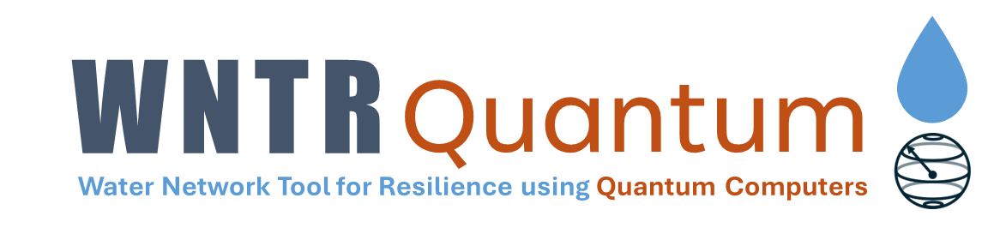

[](https://www.python.org/)
[](https://github.com/quantumapplicationlab/wntr-quantum/blob/main/LICENSE.txt)
[](https://github.com/psf/black)
[](https://github.com/quantumapplicationlab/wntr-quantum/actions/workflows/build.yml)
[](https://coveralls.io/github/QuantumApplicationLab/wntr-quantum?branch=main)




`wntr_quantum` builds on the python package [WNTR](https://github.com/USEPA/WNTR) to leverage quantum computing for the simulation and optimization of water networks. The main capablities of the software are:

### 1. Quantum Enhanced Newton-Raphson Algorithm
The [`QuantumEpanetSimulator`](https://github.com/QuantumApplicationLab/wntr-quantum/blob/01cd077bc6726660ff6323329169e807951db9c1/wntr_quantum/sim/epanet.py#L75C7-L75C29) of `wntr_quantum` use quantum solvers to solve the linear systems required as part of the Newon-Raphson GGA algorithm. Several quantum linear solvers are available:
- Harrow–Hassidim–Lloyd ([HHL](https://github.com/QuantumApplicationLab/wntr-quantum/blob/main/docs/notebooks/linear_solver/hhl_solver.ipynb)) : Gate based quantum solution. See example for [Net0](https://github.com/QuantumApplicationLab/wntr-quantum/blob/main/docs/notebooks/newton_raphson_Net0/qnr_hhl.ipynb)
- Variational Quantum Linear Solver ([VQLS](https://github.com/QuantumApplicationLab/wntr-quantum/blob/main/docs/notebooks/linear_solver/vqls_solver.ipynb)) : hybrid quantum-classical gate based solution. See example for [Net0](https://github.com/QuantumApplicationLab/wntr-quantum/blob/main/docs/notebooks/newton_raphson_Net0/qnr_vqls.ipynb) and on [Net2loops](https://github.com/QuantumApplicationLab/wntr-quantum/blob/main/docs/notebooks/newton_raphson_Net2Loops/qnr_vqls.ipynb)
 - QUBO Linear Solver ([QUBOLS](https://github.com/QuantumApplicationLab/wntr-quantum/blob/main/docs/notebooks/linear_solver/qubols_solver.ipynb)) : Quantum Annealing solution. See example for [Net0](https://github.com/QuantumApplicationLab/wntr-quantum/blob/main/docs/notebooks/newton_raphson_Net0/qnr_qubols.ipynb) and on [Net2loops](https://github.com/QuantumApplicationLab/wntr-quantum/blob/main/docs/notebooks/newton_raphson_Net2Loops/qnr_qubols.ipynb)

### 2. Quantum Hydraulics Simulations
The [`FullQuboPolynomialSimulator`](https://github.com/QuantumApplicationLab/wntr-quantum/blob/0ca53baa9d3a0b4ccb27d5232a32c5f8161e15b6/wntr_quantum/sim/core_qubo.py#L14C7-L14C34) recast the hydraulics equation as a Quadratic Unconstrained Binary Optimization (QUBO) problem, that can be solved using quantum annealers. 

### 3. Quantum Optimization of Water Networks
The [`QUBODesignPipeDiameter`](https://github.com/QuantumApplicationLab/wntr-quantum/blob/0ca53baa9d3a0b4ccb27d5232a32c5f8161e15b6/wntr_quantum/design/qubo_pipe_diam.py#L32C7-L32C29) recast the hydraulics equation and the pipe-diameter optimization as a Quadratic Unconstrained Binary Optimization problem, that can be solved using quantum annealers.  


## Installation

To install wntr_quantum from GitHub repository, do:

```console
git clone git@github.com:QuantumApplicationLab/wntr-quantum.git
cd wntr-quantum
python -m pip install .
```

## Installation of EPANET Quantum

WNTR Quantum can use a dedicated EPANET solver that allows to offload calculation to quantum linear solvers. This custom EPANET code can be found at : https://github.com/QuantumApplicationLab/EPANET. To install this sover follow the instructions below:


```
# clone EPANET
git clone https://github.com/QuantumApplicationLab/EPANET

# build EPANET
cd EPANET
mkdir build
cd build 
cmake .. 
cmake --build . --config Release

# copy the shared lib
cp lib/libepanet2.so <path to wntr-quantum>/wntr-quantum/wntr_quantum/epanet/Linux/libepanet22_amd64.so

# export environment variable
export EPANET_TMP=<path to tmp dir>/.epanet_quantum 
export EPANET_QUANTUM = <path to EPANET_QUANTUM>
```
## Example

The example below shows how to use the Variational Quantum Linear Solver to solve the linear systems required in the Newton-Raphson-GGA algorithm.

```python
import wntr
import wntr_quantum
from qiskit.circuit.library import RealAmplitudes
from qiskit.primitives import Estimator
from qiskit_algorithms import optimizers as opt
from quantum_newton_raphson.vqls_solver import VQLS_SOLVER

# define the water network 
inp_file = 'Net2Loops.inp'
wn = wntr.network.WaterNetworkModel(inp_file)

# define the vqls ansatz
n_qubits = 3
qc = RealAmplitudes(n_qubits, reps=3, entanglement="full")
estimator = Estimator()

# define the VQLS solver
linear_solver = VQLS_SOLVER(
    estimator=estimator,
    ansatz=qc,
    optimizer=[opt.COBYLA(maxiter=1000, disp=True), opt.CG(maxiter=500, disp=True)],
    matrix_decomposition="symmetric",
    verbose=True,
    preconditioner="diagonal_scaling",
    reorder=True,
)

# use wntr-quantum to solve the network
sim = wntr_quantum.sim.QuantumEpanetSimulator(wn, linear_solver=linear_solver)
results_vqls = sim.run_sim(linear_solver=linear_solver)
```
## Contributing

If you want to contribute to the development of wntr_quantum,
have a look at the [contribution guidelines](CONTRIBUTING.md).

## Credits

This package was created with [Cookiecutter](https://github.com/audreyr/cookiecutter) and the [NLeSC/python-template](https://github.com/NLeSC/python-template).
